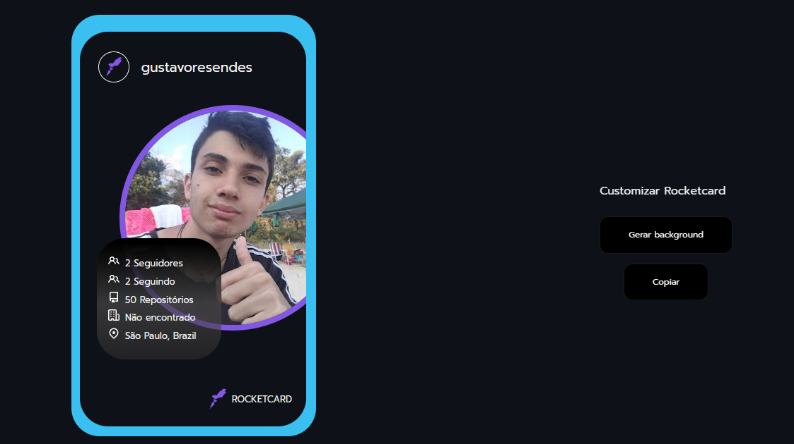

<h1 align="center">Rocketcard</h1>

Card customizável

  <a href="#-tecnologias">Tecnologias</a>&nbsp;&nbsp;&nbsp;|&nbsp;&nbsp;&nbsp;
  <a href="#-projeto">Projeto</a>&nbsp;&nbsp;&nbsp;|&nbsp;&nbsp;&nbsp;
  <a href="#-layout">Layout</a>

 

  

## 🚀 Tecnologias

Esse projeto foi desenvolvido com as seguintes tecnologias:

- JavaScript/Typescript
- [ReactJS](https://reactjs.org/)
- CSS
- [Vite](https://vitejs.dev/)
- [Npm](https://www.npmjs.com/)

## 💻 Projeto

Projeto que cria cards customizáveis utilizando a API do GitHub.

- [x] Informações básicas (foto, seguidores, localização, repositórios, etc)
- [x] Personalização do background do card.

Funcionalidades a serem implementadas:

- [ ] Funcionalidade para copiar o card no clipboard do usuário.
